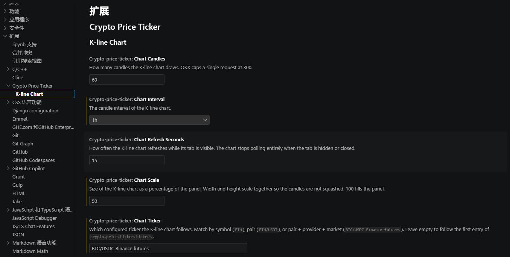

# Crypto Price Ticker for VS Code

Monitor real-time cryptocurrency prices in the Visual Studio Code status bar, and open a live K-line chart in the bottom panel — next to the terminal. Stay updated with Bitcoin, Ethereum, and any other supported pair from Binance and OKX while you code.

## Key Features

- **Live Crypto Prices**: View up-to-date prices for your favorite cryptocurrencies such as BTC, ETH, and more.
- **Foldable Status Bar**: Prices stay hidden behind a pulse icon until you need them.
- **K-line Chart**: Candlestick chart in a dedicated **Crypto** tab of the bottom panel, fed by Binance and OKX public kline endpoints.
- **Multiple Providers**: Fetch data from **Binance** (spot + USDⓈ-M futures) and **OKX** (spot + perpetual swap).
- **Customizable Tickers**: Choose coins, quote currencies, providers, markets, colors, and display templates.
- **Track Multiple Coins**: Add as many tickers as you want.
- **Auto Refresh**: Set your own refresh interval or update only when VS Code is focused.
- **Secret Storage API Keys**: Optional keys raise rate limits without writing credentials into `settings.json`.
- **Lightweight & Fast**: The chart polls only while its tab is visible; an unused chart costs nothing.

## Installation

1. Open Visual Studio Code.
2. Go to the Extensions view (`Ctrl+Shift+X`).
3. Search for `crypto-price-ticker` and install it.
4. Or install directly from [Visual Studio Marketplace][marketplace].

[marketplace]: https://marketplace.visualstudio.com/items?itemName=Mavis2103.crypto-price-ticker

## How to Use

### Folding the Ticker

The status bar shows a small **pulse icon** on the left. Prices are folded behind it by default to keep your status bar clean:


- **Click the icon** to show the crypto prices (the icon switches to a chart).
- **Click it again** to hide them.


Your choice is remembered for the next session. You can also run the **Toggle Crypto Price Ticker** command from the command palette (`Ctrl+Shift+P`).

### K-line Chart

A **graph-line icon** sits to the left of the ticker. Click it to open the candlestick chart in the bottom panel:


The chart lives in its own **Crypto** tab, next to Terminal / Problems / Output. It follows one of your configured tickers, draws SVG candles, and shows the last price plus the change over the visible range:


You can also:

- Run **Show K-line Chart** from the command palette (`Ctrl+Shift+P`).
- Press `Ctrl+Alt+K`.

The chart only polls while the tab is visible. Hide or close it and network traffic stops. Resize the panel and the candles redraw from the data already in hand — no extra API call.

### Configuration

Use **' Ctrl+, '** to Edit your VS Code `settings.json` to customize the extension, or use the Settings UI under **Extensions → Crypto Price Ticker** / **K-line Chart**:



```jsonc
// Refresh interval in seconds (status bar tickers)
"crypto-price-ticker.interval": 60,

// Only refresh when VSCode window is focused (true/false)
"crypto-price-ticker.onlyRefreshWhenFocused": false,

// Color when price increases — also used for up candles
"crypto-price-ticker.higherColor": "lightgreen",

// Color when price decreases — also used for down candles
"crypto-price-ticker.lowerColor": "coral",

// Array of ticker definitions (User settings only — see below)
"crypto-price-ticker.tickers": [
  {
    "symbol": "BTC",
    "currency": "USDT",
    "provider": "Binance",
    "market": "spot",
    "template": "{symbol} {price} {percent}"
  },
  {
    "symbol": "ETH",
    "currency": "USDT",
    "provider": "OKX",
    "market": "swap",
    "template": "{symbol} {price} {percent}"
  }
],

// K-line chart — which configured ticker to follow
// Match by symbol (ETH), pair (ETH/USDT), or pair + provider + market
// (BTC/USDC Binance futures). Leave empty to follow the first ticker.
"crypto-price-ticker.chartTicker": "BTC/USDT Binance futures",

// Candle interval: 1m | 5m | 15m | 1h | 4h | 1d
"crypto-price-ticker.chartInterval": "1h",

// How many candles to draw (10–300; OKX caps a single request at 300)
"crypto-price-ticker.chartCandles": 60,

// How often the chart refreshes while its tab is visible (5–600 seconds)
"crypto-price-ticker.chartRefreshSeconds": 15,

// Chart size as a percentage of the panel (40–100). Width and height
// scale together so candles are not squashed. 100 fills the panel.
"crypto-price-ticker.chartScale": 50
```

> **Keep your settings out of git.** The `crypto-price-ticker.tickers` setting is scoped to **User settings** on purpose — VS Code will refuse to write it into a workspace `.vscode/settings.json`, so it can never be committed to a repository. Open it with `Ctrl+Shift+P` → `Preferences: Open User Settings (JSON)`.

### API Keys (Secret Storage)

API keys are stored in VS Code's **Secret Storage** (encrypted with your OS keychain), never in settings files:

1. Run `Ctrl+Shift+P` → **Set API Keys**.
2. Pick the provider, then paste your API key and secret key. Both inputs are masked.
3. Keys take effect immediately. Run **Clear API Keys** to remove them.

Keys are optional on both providers — they only raise rate limits, for the status bar and the K-line chart alike. If you previously stored keys under `crypto-price-ticker.providers`, they still work as a fallback, but a warning will nudge you toward Secret Storage.

### Market Types

Each ticker can fetch from the spot market or a derivatives market:

| Provider | `market` | Example pair |
| -------- | -------- | ------------ |
| Binance | `spot` | `BTCUSDT` |
| Binance | `futures` (USDⓈ-M perpetual) | `BTCUSDT` |
| OKX | `spot` | `BTC-USDT` |
| OKX | `swap` (perpetual) | `BTC-USDT-SWAP` |

A `market` a provider doesn't serve (e.g. `swap` on Binance) silently falls back to `spot`. The K-line chart uses the same provider and market as the ticker it follows.

### Template Tags

| Tag     | Description                       |
| ------- | --------------------------------- |
| symbol  | Cryptocurrency symbol (e.g., BTC) |
| market  | Market badge: `Ⓢ` spot, `Ⓜ` futures, `Ⓟ` swap |
| price   | Current price                     |
| open    | Opening price for the period      |
| high    | Highest price in the period       |
| low     | Lowest price in the period        |
| change  | Price difference from opening     |
| percent | Percentage change from opening    |

**Example:**

```jsonc
"template": "{symbol} {price} {percent}"
```

The default template is `{symbol}{market} {price}`, which renders as `BTCⓈ 67000.00` for a spot ticker and `BTCⓂ 67000.00` for a futures one. Remove `{market}` from the template to hide the badge.

### Example Configuration

```jsonc
"crypto-price-ticker.tickers": [
  {
    "symbol": "BTC",
    "currency": "USDT",
    "provider": "Binance",
    "market": "futures",
    "template": "{symbol}: {price} ({percent})"
  },
  {
    "symbol": "ETH",
    "currency": "USDT",
    "provider": "OKX",
    "market": "swap",
    "template": "{symbol}: {price} ({percent})"
  }
],
"crypto-price-ticker.chartTicker": "BTC/USDT Binance futures",
"crypto-price-ticker.chartInterval": "1h",
"crypto-price-ticker.chartCandles": 60,
"crypto-price-ticker.chartRefreshSeconds": 15,
"crypto-price-ticker.chartScale": 50
```

API keys are **not** set here — use the **Set API Keys** command described above.

## Supported Crypto Data Providers

- **Binance** — [binance.com](https://binance.com)
- **OKX** — [okx.com](https://okx.com)

## API Rate Limits

> **Important:** Both Binance and OKX enforce API rate limits. Setting a very low refresh interval or tracking too many tickers may result in temporary bans or incomplete data.
>
> - **Binance**: [API rate limits](https://binance-docs.github.io/apidocs/spot/en/#limits) apply per IP and endpoint.
> - **OKX**: [API rate limits](https://www.okx.com/docs-v5/en/#rest-api-rate-limit) also apply per IP and endpoint.
>
> **Recommendation:** Use a refresh interval of 60 seconds or higher and limit the number of tracked tickers for best results. The K-line chart has its own cadence (`chartRefreshSeconds`, default 15s) and stops polling when hidden. Providing API keys (optional) can help increase your rate limits and access more data.

## Why Use Crypto Price Ticker for VS Code?

- Instantly see crypto prices without leaving your coding environment.
- Open a live candlestick chart in the same panel as the terminal.
- Highly customizable and easy to set up.
- Supports the most popular exchanges, coins, and derivatives markets.

## License

[MIT](LICENSE.md)

---

**Crypto Price Ticker for VS Code** — The best way to keep track of cryptocurrency prices while coding!
